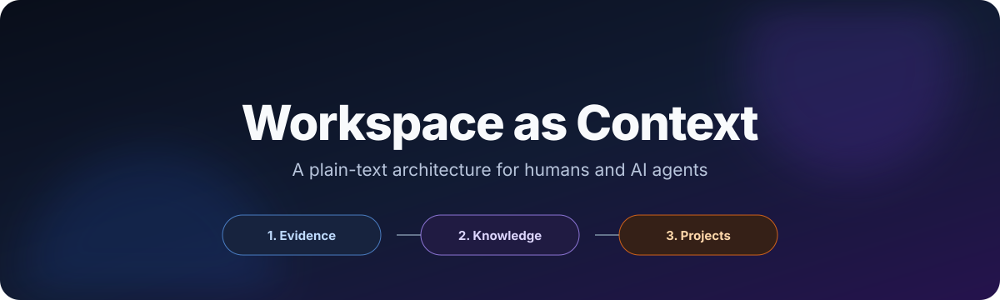
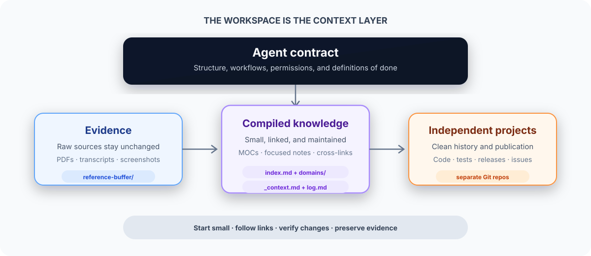

<p align="center">
  
</p>

<p align="center">
  <a href="LICENSE"></a>
  
  
  
</p>

<p align="center">
  <strong>Stop rebuilding context in every chat.</strong><br>
  Turn your workspace into a small, durable knowledge system that both you and your AI agent can understand.
</p>

---

## The idea in one minute

An AI agent is only as useful as the context it can find.

Most people solve this by pasting large prompts, reopening old chats, or asking the model to search a pile of documents. That works for a while. It becomes slow and unreliable as the pile grows.

Workspace as Context takes a different approach:

1. Keep raw evidence in one place.
2. Compile useful knowledge into small linked Markdown notes.
3. Give the agent a short operating contract that explains how the system works.
4. Keep software projects independent, so each one can be built and shipped normally.

The workspace becomes persistent context. The agent does not need your entire history in every prompt. It starts with one small context file, follows links when it needs detail, and updates the system as new information arrives.

<p align="center">
  
</p>

## Why this exists

Long-running work creates three problems.

### 1. Important context gets trapped

Useful information ends up spread across chats, PDFs, screenshots, notes, and code repositories. You know that the answer exists, but neither you nor the agent can find it quickly.

### 2. Retrieval becomes expensive

Loading everything is wasteful. Searching everything on every question is also wasteful. A good workspace should make the common path cheap and allow deeper reading only when needed.

### 3. AI edits can cause silent loss

An agent may rewrite a useful note, remove a detail that looked unimportant, or create a new file that nothing links to. The workspace slowly becomes less trustworthy.

This project treats those problems as architecture problems, not prompt problems.

## What you get

This repository contains two things:

| Part | What it gives you |
|---|---|
| A set of principles | Clear rules for structuring knowledge, guiding agents, and making safe changes |
| A starter workspace | A small folder you can copy and adapt without installing a framework |

There is also a tiny audit tool. It checks the starter workspace for broken wikilinks and orphan notes. The tool uses only the Python standard library.

## Who this is for

Workspace as Context is useful if you:

- work with Codex, Claude Code, Cursor, or another file-aware AI agent
- keep research, decisions, and projects over many months
- want your notes to remain readable without a specific application
- use Obsidian or like backlink-based navigation
- care about privacy, version history, and control over your files
- want software projects to stay independent from your personal knowledge base

It is probably not useful if you only need short, disposable chats or if all your work already lives in a well-maintained company knowledge system.

## The three-layer model

### Layer 1: Evidence

Evidence is the raw material. Examples include PDFs, transcripts, screenshots, exports, meeting notes, and saved articles.

Evidence should be treated as immutable. The agent reads it but does not rewrite it. This preserves provenance and gives you something to return to when a summary is wrong.

In the starter workspace, evidence lives in `reference-buffer/`.

### Layer 2: Compiled knowledge

Compiled knowledge is the small set of Markdown notes you actually navigate and reuse. These notes contain decisions, summaries, concepts, plans, and links to related notes.

Each domain has a map of content, or MOC. A MOC is simply a hub page that tells the reader what exists in that domain and where to go next.

The important point is that the agent reads a small map before reading an entire folder.

### Layer 3: Shippable projects

Projects are codebases or public artifacts that should have their own history, dependencies, tests, and repository.

They may be informed by the knowledge layer, but they should not be buried inside it. Keeping projects independent makes them easier to publish, collaborate on, and evaluate.

## The seven principles

The full explanation is in [PRINCIPLES.md](PRINCIPLES.md).

| Principle | Plain-English meaning |
|---|---|
| Compile knowledge once | Turn repeated research into a maintained note instead of reconstructing it every time |
| Make retrieval cheap | Start small, then follow links only when more detail is needed |
| Separate evidence, knowledge, and execution | Give raw sources, maintained notes, and projects different jobs |
| Give the agent a contract | Put durable rules in `AGENTS.md` instead of relying on memory |
| Prefer append and link | Preserve useful history and make targeted changes |
| Keep the graph connected | Every meaningful note should be reachable from a map or related note |
| Isolate what you ship | Keep each software project as an independent repository |

## How a normal session works

The system is designed around progressive disclosure.

```text
Start session
    ↓
Read _context.md
    ↓
Identify the relevant domain
    ↓
Read that domain's MOC
    ↓
Open only the notes needed for the task
    ↓
Do the work
    ↓
Update links, log, and context when something meaningful changed
```

The agent gets enough information to begin without loading the whole workspace.

### Example

Imagine that you saved three interviews about product discovery.

1. Put the original transcripts in `reference-buffer/`.
2. Ask the agent to process one transcript.
3. The agent creates or updates a focused note such as `learning/product-discovery.md`.
4. It links that note from the learning MOC.
5. It adds links to related notes such as customer interviews or prioritization.
6. It records the change in `log.md`.
7. If the new information changes an active decision, it updates `_context.md`.

The next time you ask about product discovery, the agent starts with the learning MOC and opens only the relevant notes. It does not need to read all three transcripts again.

## Why each design choice exists

| Choice | Why it exists | What happens without it |
|---|---|---|
| `_context.md` | Gives the agent a fast and current starting point | Every session begins with repeated explanation or broad search |
| `index.md` | Gives humans a stable front door | The folder tree becomes the only navigation system |
| Domain MOCs | Narrow retrieval before deeper reading | The agent scans entire domains for simple questions |
| `reference-buffer/` | Preserves raw evidence and provenance | Summaries replace sources and errors become hard to audit |
| `AGENTS.md` | Stores durable operating rules close to the files | Each chat depends on remembered instructions |
| `log.md` | Records meaningful changes in order | Decisions and structural changes become difficult to trace |
| Wikilinks | Make relationships visible to humans and agents | Notes become isolated documents with weak discovery |
| No-orphan rule | Keeps every important note reachable | The knowledge base fills with forgotten files |
| Append-first editing | Reduces accidental information loss | Clean rewrites silently remove context |
| Independent project repos | Preserves clean code history and publication boundaries | Personal knowledge and project code become tangled |

For a deeper system-design explanation, read [REFERENCE-ARCHITECTURE.md](REFERENCE-ARCHITECTURE.md).

## Quick start

### Option A: Copy the starter workspace

```bash
git clone https://github.com/abhishekl-offl/workspace-as-context.git
cp -R workspace-as-context/starter my-workspace
cd my-workspace
git init
```

Then:

1. Open `AGENTS.md` and replace the example rules with your own.
2. Update `_context.md` with your current work and priorities.
3. Rename `domains/example/` to your first real domain.
4. Open the folder as an Obsidian vault if you want graph navigation.
5. Open the same folder in your file-aware AI tool.
6. Ask the agent to read `_context.md` before helping.

### Option B: Adapt an existing folder

Do not move everything at once. Add the control files first:

```text
AGENTS.md
_context.md
index.md
log.md
reference-buffer/
```

Then migrate one domain at a time. The [adoption guide](ADOPTION-GUIDE.md) explains the process and the safety checks.

## Starter workspace tour

```text
starter/
├── AGENTS.md
├── _context.md
├── index.md
├── log.md
├── reference-buffer/
│   └── README.md
├── domains/
│   └── example/
│       ├── example.md
│       └── first-note.md
└── projects/
    └── README.md
```

### `AGENTS.md`

This is the operating contract. It tells the agent:

- what to read at session start
- how the workspace is structured
- how to add new information
- how to link notes
- which changes need human approval
- how projects are separated

Keep this file specific. Generic advice such as "be careful" is less useful than a rule such as "never rewrite raw source files."

### `_context.md`

This is the fast-start file. It should answer:

- What is this workspace for?
- What is active now?
- What was decided recently?
- What should happen next?
- Which file contains deeper information on each topic?

It is not a full autobiography or database. Its job is routing.

### `index.md`

This is the human entry point. It links to each domain MOC and the main operating files.

### `log.md`

This is an append-only timeline of meaningful changes. It is not a transcript of every small edit.

### Domain MOCs

Each domain MOC links down to focused notes and across to related domains. It should help a reader understand the shape of the domain without opening every file.

### `projects/`

This folder documents how independent repositories relate to the workspace. The starter does not force Git submodules. You can use submodules, sibling repositories, or simple links. The important rule is to preserve an independent project history.

## Core workflows

### Start a session

1. Read `_context.md`.
2. Identify the relevant domain.
3. Read that domain's MOC.
4. Open only the notes required for the task.

### Ingest a source

1. Put the source in `reference-buffer/`.
2. Read the source without modifying it.
3. Create or update a focused knowledge note.
4. Add links from the domain MOC and related notes.
5. Add an entry to `log.md`.
6. Update `_context.md` only if the active state changed.

### Create a new note

1. Give it one clear topic.
2. Use a filename that is easy to link.
3. Link it from a MOC or related note in the same change.
4. Add a `Related` section when useful.
5. Avoid copying information that already has a canonical home.

### Work on a software project

1. Enter the project's own repository.
2. Read its README and local agent instructions.
3. Make and verify changes inside that repository.
4. Commit to the project, not to the knowledge workspace.
5. Update the workspace only when a meaningful project status or decision changed.

## Audit the workspace

The included audit tool checks Obsidian-style wikilinks and graph connectivity.

```bash
python3 tools/audit_workspace.py starter
```

Expected result:

```text
Workspace audit passed
Markdown files: 8
Wikilinks: 13
Broken links: 0
Orphan notes: 0
```

The tool is intentionally small. It does not build a search index or call an LLM. Its job is to catch two common forms of knowledge decay:

- a link points to a file that does not exist
- a note exists but nothing in the workspace links to it

## What this is not

### It is not a replacement for search

Search remains useful when you do not know where something belongs. The architecture simply makes normal retrieval cheaper and more predictable.

### It is not a RAG framework

RAG retrieves chunks from source material at query time. This pattern maintains a human-readable knowledge layer between raw sources and questions. You can still add search or RAG later if the workspace becomes large.

### It is not an autonomous memory system

The agent does not decide what is true on its own. Important summaries and decisions still benefit from human review.

### It is not an excuse to document everything

The goal is useful context, not maximum note count. A small, well-linked workspace is better than a large archive that nobody trusts.

## Trade-offs

| Benefit | Cost |
|---|---|
| Plain files are portable and durable | Some structure must be maintained |
| Linked notes reduce repeated research | Poorly chosen links can add noise |
| Agent rules improve consistency | Rules need occasional updates |
| Independent projects stay clean | Cross-repository changes require care |
| Human-readable knowledge is easy to audit | Compilation takes effort when a source first arrives |

The architecture is most useful when the value of retained context is higher than the small cost of maintaining it.

## Security and privacy

This repository is a public template. Your real workspace may be private.

- Do not commit passwords, API keys, private customer data, medical records, or confidential employer information.
- Keep raw personal sources in a private or ignored folder.
- Review every file before making a workspace public.
- Treat project repositories and the knowledge workspace as separate publication decisions.
- Use redacted or synthetic examples in public case studies.

## Frequently asked questions

### Do I need Obsidian?

No. Obsidian is a useful viewer for wikilinks and graph navigation, but the system is plain Markdown and works without it.

### Which AI tools work with this?

Any tool that can read and edit local files can use the pattern. The starter uses `AGENTS.md`, which is understood by Codex and can be adapted for other tools.

### Why not keep everything in one long file?

One file is simple at first. It becomes expensive to load, difficult to navigate, and easy to damage. Small focused notes let the reader load only what is needed.

### Why use both `_context.md` and `index.md`?

They serve different readers. `_context.md` is a compact session router for the agent. `index.md` is the stable map for a human browsing the workspace.

### Why keep a log if Git already has history?

Git records file changes. `log.md` records the meaning of important changes. It gives a reader a quick timeline without requiring them to inspect commits.

### Should every edit update `_context.md`?

No. Update it when an active decision, status, priority, or important file changes. Routine edits belong in the note itself.

### Can teams use this?

Yes, but teams need clearer ownership, review rules, and access control. This first version is optimized for an individual or a small trusted group.

## Project structure

```text
workspace-as-context/
├── README.md
├── PRINCIPLES.md
├── REFERENCE-ARCHITECTURE.md
├── ADOPTION-GUIDE.md
├── ACKNOWLEDGEMENTS.md
├── AGENTS.md
├── assets/
├── starter/
├── tools/
├── tests/
└── .github/workflows/
```

## Design goals

This project is successful if:

- the full system can be understood without a video
- the starter works without a paid service or framework
- every important design choice has a written reason
- the public example contains no private workspace data
- the audit tool catches broken links and orphan notes
- a new user can adopt the pattern in under an hour

## Roadmap

- [x] Publish the principles and reference architecture
- [x] Provide a minimal starter workspace
- [x] Add a zero-dependency graph audit tool
- [ ] Add sanitized case studies from different workspace types
- [ ] Add optional templates for teams and research projects
- [ ] Gather real adoption feedback before adding more tooling

The project will stay small unless real use reveals a clear need.

## Origins and attribution

This project was inspired by Andrej Karpathy's [LLM Wiki](https://gist.github.com/karpathy/442a6bf555914893e9891c11519de94f), which describes an LLM-maintained layer of interlinked Markdown between raw sources and user questions.

Its editing discipline was also influenced by the community-maintained [Karpathy-Inspired Claude Code Guidelines](https://github.com/multica-ai/andrej-karpathy-skills), which distill common failure modes in AI-assisted coding.

Workspace as Context is a concrete adaptation. Its contribution is the combined architecture of fast-start context, domain maps, zero-loss maintenance, graph health, and independent shippable projects.

See [ACKNOWLEDGEMENTS.md](ACKNOWLEDGEMENTS.md) for the detailed attribution boundary.

## License

[MIT](LICENSE). Use the structure, change it, and adapt it to your own work.
